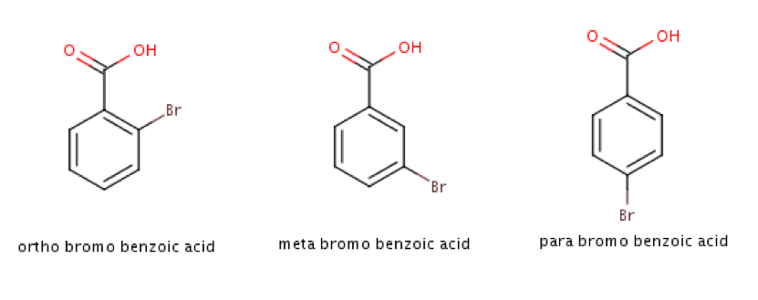

```{r echo=FALSE}
library("knitr")
```

# Purpose

# Introduction

One focus of Chemical Informatics is to try to predict the behavior of a compound based 
on its structure. Especially, behavior in a biological system can be very complex and 
difficult to predict in a simple way. Some examples are:

* drug activity
* drug side effects
* environmental toxicity

These are complex types of behavior and are difficult to predict. One way to approach 
this problem is known as a QSAR – Quantitative Structure-Activity Relationship. 
@PETER2019661 The most common approach to QSAR is rather like constructing a Calibration 
Curve, except that multiple variables are used in building the model. You start with a 
series of “descriptors” - numbers that describe the structure of the
molecule which are easy to compute or measure, for example: MW, solubility, number of 
hydrogen- bond-donors, dipole moment, and many others. Using these it is possible to 
build a multiple regression model: an equation to predict the activity of interest:

`
activity = intercept + (const1)*(descriptor1) + ( const2)*(descriptor2) + (const3)*(descriptor3) ...
`

In this case, the “activity” represents the Dependent variable (also called the Response variable) and the “descriptors” represent multiple Independent variables (also called Explanatory variables).  This equation is an expansion of the standard formula for a straight line:

`
y = mx + b
`

in this case “b” is the intercept and “m” is the slope.  

The sample data file for this exercise (benzoate-pka.txt) gives data on a series of 
substituted benzoic acids.  The Hammett plot has been used in physical organic chemistry 
to understand the effect of electron-donating and electron-withdrawing groups on a given 
reaction.  The Hammett sigma value could be considered an electronic molecular 
descriptor, although it is not one typically used in cheminformatics applications.
This works well if all of your data points have the same substitution pattern - either 
all meta or all para.  What if you have all three substitution patterns present in your 
dataset?  



We will use this method to model the pKa values for a series of substituted benzoic 
acids. Substituents on the benzene can affect the pKa of benzoic acid – electron 
withdrawing substituents lower the pKa (more acidic), and electron donating substituents 
increase the pKa (less acidic). The **Sigma value** of a substituent is a measure of how 
strongly electron-donating or electron-withdrawing it is. But the value of Sigma, and 
the pKa both depend on its location on the benzene ring: _ortho_, _meta_ or _para_. As a 
result, two different versions of sigma are included in the data file:
**sigma.m** for when the substituent is meta, and **sigma.p** for when the substituent 
is para. For _ortho_ substituents, the sigma.p value can be used.

As a further refinement, we can add Indicator Variables to the model.  In the dataset 
there are three indicator variables that are either one or zero to indicate the position 
of the substituent in each molecule in the dataset, whether it is ortho, meta or para.  
There are three other descriptors as well: TPSA describes the total polar surface area 
of the molecule, logP describes its solubility in water versus in octanol, and MR is the 
molar refractivity which has to do with the polarizability of the molecule.

Insert a link here as well. 

# Experimental Methods

# Results

## Exploratory Analysis of _pKa_ values

### pKa Values

There are XXX values and the median value is Y.
(This will be generated code potentially?)

### Plots

Insert code for boxplot and histogram, with titles.

### Outliers

## Model Building Results

###  model.all results

Give the plot a title and copy it into this report.
Use the summary() command to get the coefficients and Multiple R-squared. 
This also gives you Pr values for all the descriptors – you will need this for Part D.

What is the equation for this model?
e.g.  pka = 31563146  + 3554first-descriptor – 2345second-descriptor + ……..

Discuss how good the fit is, including the Multiple R-squared.
(a good fit will have R-squared close to 1.0, the closer the better)

###  model.5 results

Give the plot a title and copy it into this report.
Use the summary() command to get the coefficients and Multiple R-squared. 
This also gives you Pr values for all the descriptors – you will need this for Part D.

What is the equation for this model?
e.g.  pka = 31563146  + 3554first-descriptor – 2345second-descriptor + ……..

Discuss how good the fit is, including the Multiple R-squared.
(a good fit will have R-squared close to 1.0, the closer the better)

###  model.2 results

Give the plot a title and copy it into this report.
Use the summary() command to get the coefficients and Multiple R-squared. 
This also gives you Pr values for all the descriptors – you will need this for Part D.

What is the equation for this model?
e.g.  pka = 31563146  + 3554first-descriptor – 2345second-descriptor + ……..

Discuss how good the fit is, including the Multiple R-squared.
(a good fit will have R-squared close to 1.0, the closer the better)

###  model.1 results

Give the plot a title and copy it into this report.
Use the summary() command to get the coefficients and Multiple R-squared. 
This also gives you Pr values for all the descriptors – you will need this for Part D.

What is the equation for this model?
e.g.  pka = 31563146  + 3554first-descriptor – 2345second-descriptor + ……..

Discuss how good the fit is, including the Multiple R-squared.
(a good fit will have R-squared close to 1.0, the closer the better)

## Discussion

3.1  In general, how does the ability of the model to predict the pKa compare as you 
increase the number of “descriptors” (model.1 → model.2  → model.5 → model.all)?  
Consider how the plots for the three models look and the Multiple R-squared values for 
the three models.

3.2  Statisticians will talk a parsimonious model as being preferred:  use the simplest 
model that gives the best explanation.  Given this, how does model.2 compare to the 
others?  Do you think this is an improvement or not? Explain.

The original dataset had two outliers removed for you. You can't just ignore data points 
that you don't like – there needs to be a valid reason for leaving them out. Consider 
the chemistry of these molecules.  Look closely at the structures of the molecules.

3.3  For o-Hydroxybenzoic acid the actual pKa is 2.98, but the model predicted a pKa of 
3.77. What is the structure of _o_-hydroxybenzoic acid? Based on the structure, explain 
why the REAL pKa is lower than the model thinks it is – that is: it is a stronger acid than it “should” be according to the model. When this acid ionizes, the resulting carboxylate ion is more stable that you would think it should be – why?
Note: the _meta_ and _para_ versions do not show this anomalous behavior.

3.4
For _o_-aminobenzoic acid the actual pKa is 4.98, but the model predicted a pKa of 4.09. What is the structure of _o_-Aminobenzoic acid?

Based on the structure, explain why the REAL pKa is higher than the model thinks it is. 
It is harder than it “should be” to remove a hydrogen ion from this molecule – explain
why.
Note: the meta and para versions do not show this anomalous behavior.

3.5  Since the model is describing the behavior of actual chemical compounds, it is important that the descriptors used in the model make "chemical sense" for the property they are meant to predict. Based on your knowledge of chemistry, why do you think the descriptors in model.2 are the best choices to explain pKa?

# References

