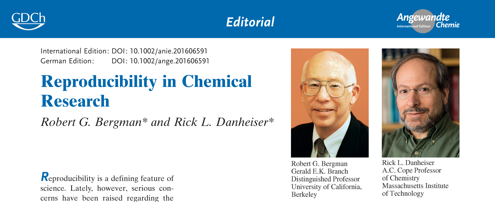

```{r setup, include=FALSE}
knitr::opts_chunk$set(echo = FALSE)
```

## Welcome
- Restrooms
- Wireless internet connection
- Pre-workshop survey https://forms.gle/wjKkYmZR1xHeYUot9 
- Please accept the invitation from RStudio Cloud and create an account if you have not
- Open group note-taking http://bit.ly/notesRChem 
- Link to slides 

## Acknowledgement

<br />  


<br />   


## Agenda
- Test technical setup 
- Learn R Basics 
- Apply R to a QSAR mini-project
- Write a report with R Markdown 

## Introduce yourself
- Your name
- Why are you interested in this workshop
- Anything else you'd like to share with the group

## There Are No Stupid Questions! {#questions}
- Post sticky notes to the back of your laptop to signal the instructors and helpers

Hot pinky note means stop                    Blue note means go
-----------------------------------     ----------------------------------  
        

## R Basics
- Computational reproducibility and R
- R, RStudio, and RStudio Cloud overview
- Project Management in RStudio 
- Basic programming in R
  - plotting a calibrarion curve
- Getting help

## Reproduciblity in Chemistry {#chem}
- Source of Irreproducibility
  - Rarely deliberate falsification
  - Unconscious investigator bias
    - Incorrect data or modified results to fit their preconceptions
  - *bona fide* results that's difficult to repeat

  
https://doi.org/10.1002/anie.201606591 


## NASEM Consensus Report defined Reproduciblity as Computational Reproducibility | May 2019 {#report}

<div class="columns-2">
- **Reproducibility**: Obtaining consistent results using the **same input data, computational steps, methods and conditions of analysis**
- **Replicability**: Obtaining consistent results across studies aimed at answering the **same scientific question**, each of which has **obtained its own data**

 https://doi.org/10.17226/25303 .

  
</div>

## Computational Reproducibility 
All the components below are required to reproduce the research publication

The practice of distributing
--------------------------------------------  ------   
All data 
Software source codes or scripts for analysis
Tools (and the computing environment needed)

## Facets for Reproducible Research Workflow
- Organization
  - e.g. folder structure, naming convention, bundle computing environment etc.
- Automation
  - e.g. script-based data analysis and writing, version control etc.
- Documentation
  - e.g. Readme file, comments in data and code, ELN etc.
- Dissemination 
  - e.g. repositories, persistant identifiers, open licensing etc.

## Why R for reproducible research?
- No lots of pointing and clicking - can re-run the script to reproduce the analysis
- Integrating with other tools to generate (and re-generate) your manuscript, for version control and dissemination 
- Interdisciplinary and extensible
- Working on data of all shapes and sizes
- Producing high-quality graphics
- Large and welcoming community
  - Stack Overflow(https://stackoverflow.com/)
  - RStudio Community(https://community.rstudio.com/))
- Open-source and cross-platform 

## Automated and open workflow is good for reproducibility {#logos}

Open Tools                         What is it?
--------------------------------  -----------------------------------------------------
              Programming language and the software that interprets the scripts 
        Integrated Development Environment (IDE) Popular way to write R scripts and interact with the R software
   A managed cloud instance of RStudio. Good for teaching and learning


## RStudio / RStudio Cloud Interface {#interface}
- All info needed to write code in a single window
- Shortcuts, autocompletion, and highlighting for the major file types


## Project management in R | Create a self-contained project folder including a set of related data, analyses, and text that organized in subfolders
- It remembers working directory and custom settings
- Steps in **RStudio**:
  - 'File' menu --> click on 'New Project'. 
  - Choose 'Existing Directory', then browse to the folder where you downloaded workshop data files.
  - Click on 'Create Project'. An ' .Rproj' file is added to the project folder.  
- Steps in **RStudio Cloud** 
  - Click on **'Start'** in front of the project "Student In-Class Practice"
  - An R Project has been created for you there.

## Project management in R | Include a set of related data, analyses, and text that organized in subfolders
- **'data/'**: use this folder to store your raw data and intermediate datasets you may create 
  - Always keep a copy of your raw data 
  - do as much of your data cleanup and preprocessing with scripts
- **'scripts/'**: use this folder for your R scripts for different analyses or plotting
- **'figures/'**: use this folder to save figures you plot using scripts
- **'data_output/'**: use this folder to save data files you obtained using scripts
- **'documents/'**: use this folder for your outlines, drafts, and other texts
- Practice: in **RStudio Cloud** / Student In-Class Practices
  - Use 'New Folder' button in the right bottom Files section to create a folder called 'documents'
 

## Project management in R | Working directory
- **Working directory**: the place from where R will be looking for and saving the files
- RStudio will now set your **working directory** as the folder where your xxx.Rproj file lives
- Practice: in **RStudio Cloud** / Student In-Class Practices
  - Open scripts/RBasicsPractice.R
  - At line 6, typing "getwd()" and run it to identify the current working directory

## Basic R commands | We will now use **RStudio Cloud** / Student In-Class Practices to learn: 
- Use R as a calculator
- Assign value to a variable in the Environment
- Remove variables from the Environment
- Get tabulized data into the Environment as data frames
  - Calibration curve example 
- Subset data frames 
- Save data output
- Plot figure and linear fit 
- Save plotted figures

## Getting Help
- I know the name of the function I want to use, but I’m not sure how to use it
  - e.g. ?plot, args(lm)
- I want to use a function that does X, there must be a function for it but I don’t know which one…
  - e.g. ??color  (call help.search() function)
- I am stuck… I get an error message that I don’t understand
  - e.g. Google, search stockoverflow.com with the tag [r] 
  - Include computing environment info when asking questions - session.info()   
  
  
## Apply R for a QSAR mini-project


## R Markdown

This is an R Markdown presentation. Markdown is a simple formatting syntax for authoring HTML, PDF, and MS Word documents. For more details on using R Markdown see <http://rmarkdown.rstudio.com>.

When you click the **Knit** button a document will be generated that includes both content as well as the output of any embedded R code chunks within the document.

## Learning Resources

- Carpentries Lessons https://carpentries.org/ 
  - R for Reproducible Scientific Analysis http://swcarpentry.github.io/r-novice-gapminder/ 
  - Data Analysis and Visualization for Ecologist https://datacarpentry.org/R-ecology-lesson/ 
- RStudio Cloud Primers
- Coursera - Data Science Specialization https://www.coursera.org/specializations/jhu-data-science 

## Slide with R Output

```{r cars, echo = TRUE}
summary(cars)
```

## Slide with Plot

```{r pressure}
plot(pressure)
```

