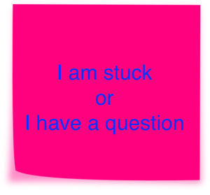
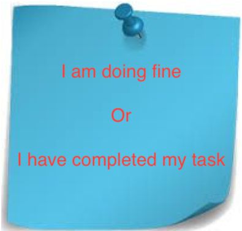
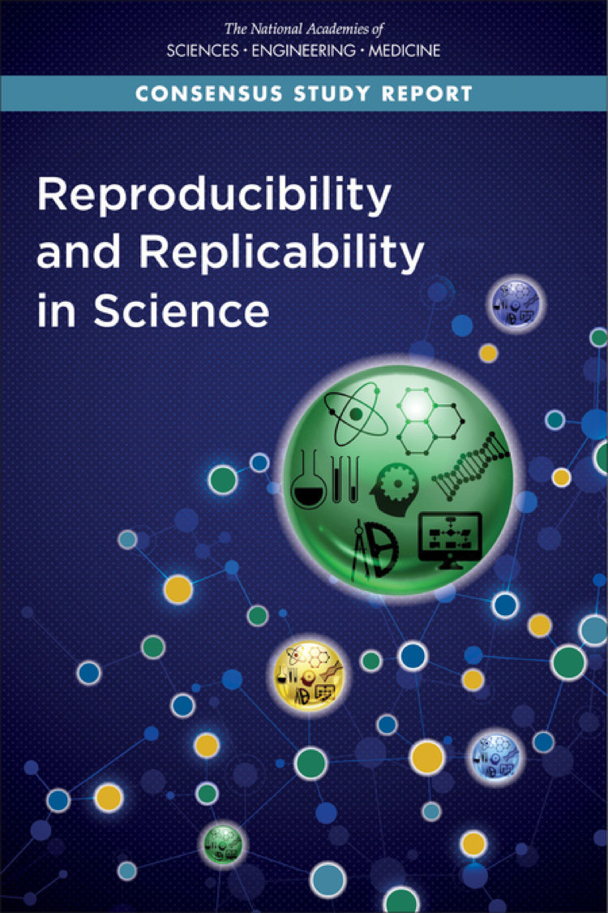
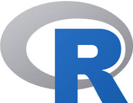
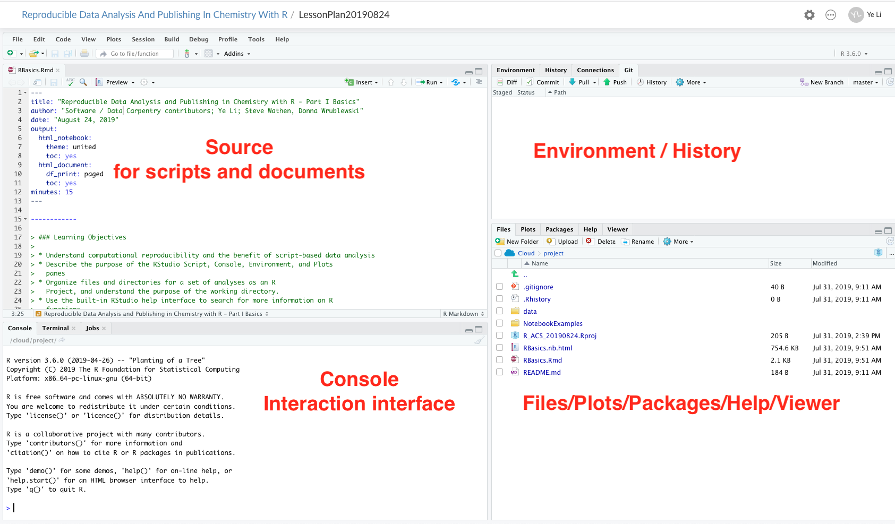

```{r setup, include=FALSE}
knitr::opts_chunk$set(echo = FALSE)
```

## Welcome
- Restrooms
- Wireless internet connection
- Pre-workshop survey
- Please accept the invitation from RStudio Cloud and create an account if you have not
- Open group note-taking

## Agenda


## Introduce yourself
- Your name
- Why are you interested in this workshop
- Anything else you'd like to share with the group

## There Are No Stupid Questions! {#questions}
- Post sticky notes to the back of your laptop to signal the instructors and helpers

Hot pinky note means stop                    Blue note means go
-----------------------------------     ----------------------------------  
        


## NASEM Consensus Report defined Reproduciblity as Computational Reproducibility | May 2019 {#report}

<div class="columns-2">
- **Reproducibility**: Obtaining consistent results using the **same input data, computational steps, methods and conditions of analysis**
- **Replicability**: Obtaining consistent results across studies aimed at answering the **same scientific question**, each of which has **obtained its own data**

 https://doi.org/10.17226/25303 .

  
</div>

## Computational Reproducibility 
All the components below are required to reproduce the research publication

The practice of distributing
--------------------------------------------  ------   
All data 
Software source codes or scripts for analysis
Tools (and the computing environment needed)


## Automated and open workflow is good for reproducibility {#logos}

Open Tools                         What is it?
--------------------------------  -----------------------------------------------------
              Programming language and the software that interprets the scripts 
        Integrated Development Environment (IDE) Popular way to write R scripts and interact with the R software
   A managed cloud instance of RStudio. Good for teaching and learning

## RStudio / RStudio Cloud Interface {#interface}
- All info needed to write code in a single window
- Shortcuts, autocompletion, and highlighting for the major file types



## Project management in R 
- Create a self-contained project folder including a set of related data, analyses, and text that organized in subfolders
- Remembers working directory and custom settings

Steps:
1. 'File' menu --> click on 'New Project'. 
2. Choose 'Existing Directory', then browse to the folder where you downloaded workshop data files.
3. Click on 'Create Project'. An ' .Rproj' file is added to the project folder.  

On RStudio Cloud, CLick on 'Start' in front of the project "Student In-Class Practice". An R Project has been created for you there.


## R Markdown

This is an R Markdown presentation. Markdown is a simple formatting syntax for authoring HTML, PDF, and MS Word documents. For more details on using R Markdown see <http://rmarkdown.rstudio.com>.

When you click the **Knit** button a document will be generated that includes both content as well as the output of any embedded R code chunks within the document.

## Slide with Bullets

- Bullet 1
- Bullet 2
- Bullet 3

## Slide with R Output

```{r cars, echo = TRUE}
summary(cars)
```

## Slide with Plot

```{r pressure}
plot(pressure)
```

