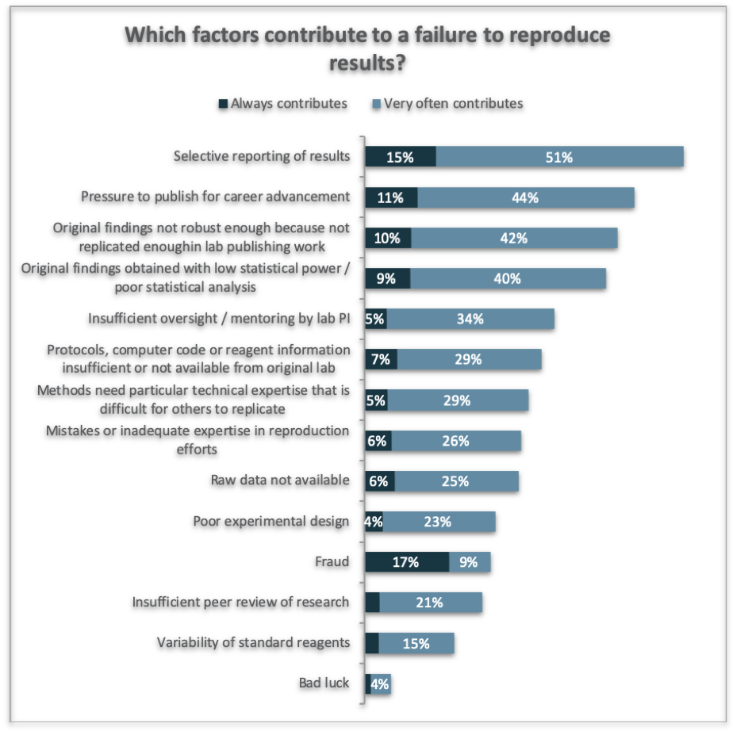

```{r setup, include=FALSE}
knitr::opts_chunk$set(echo = FALSE)
```

## Welcome
- Restrooms
- Wireless internet connection
  - OMNI Meeting, Passowrd: ACS
  - **Important** Please use it for your laptop only and for the workshop only to avoid us going beyond allocated spots
- Pre-workshop survey https://forms.gle/wjKkYmZR1xHeYUot9 
- Please accept the invitation from RStudio Cloud and create an account if you have not
- Open group note-taking http://bit.ly/notesRChem 
- Link to slides http://rpubs.com/YeLibrarian/slides20190824 

## Acknowledgement

<br />  


<br />   


## Agenda
- Test technical setup 
- Learn R Basics 
- Apply R to a QSAR mini-project
- Write a report with R Markdown 

## Introduce yourself
- Your name
- Why are you interested in this workshop
- Anything else you'd like to share with the group

## There Are No Stupid Questions! {#questions}
- Post sticky notes to the back of your laptop to signal the instructors and helpers

Hot pinky note means stop                    Blue note means go
-----------------------------------     ----------------------------------  
        

## R Basics
- Computational reproducibility and R
- R, RStudio, and RStudio Cloud overview
- Project Management in RStudio 
- Basic programming in R
  - plotting a calibrarion curve
- Getting help

## Reproduciblity in Chemistry {#chem}
- Source of Irreproducibility
  - Rarely deliberate falsification
  - Unconscious investigator bias
    - Incorrect data or modified results to fit their preconceptions
  - *bona fide* results that's difficult to repeat

  
https://doi.org/10.1002/anie.201606591 

## Factors causing irreproducible results | Nature Reproducibility Survey 2017 {#Nature}
<div class="columns-2">
- Selective reporting
- Not robust enough for replicating
- Flawed statistical methods / analysis
- Insufficient / missing protocols / methods
- Raw data not available
- Poor experimental design 
- Fraud
- Insufficient peer review
- Variability of reagents


  
 

</div>


## NASEM Consensus Report defined Reproduciblity as Computational Reproducibility | May 2019 {#report}

<div class="columns-2">
- **Reproducibility**: Obtaining consistent results using the **same input data, computational steps, methods and conditions of analysis**
- **Replicability**: Obtaining consistent results across studies aimed at answering the **same scientific question**, each of which has **obtained its own data**

 https://doi.org/10.17226/25303 .

  
</div>

## Computational Reproducibility 
All the components below are required to reproduce the research publication

The practice of distributing
--------------------------------------------  ------   
All data 
Software source codes or scripts for analysis
Tools (and the computing environment needed)

## Facets for Reproducible Research Workflow
- Organization
  - e.g. folder structure, naming convention, bundle computing environment etc.
- Automation
  - e.g. script-based data analysis and writing, version control etc.
- Documentation
  - e.g. Readme file, comments in data and code, ELN etc.
- Dissemination 
  - e.g. repositories, persistant identifiers, open licensing etc.

## Why R for reproducible research?
- No lots of pointing and clicking - can re-run the script to reproduce the analysis
- Integrating with other tools to generate (and re-generate) your manuscript, for version control and dissemination 
- Interdisciplinary and extensible
- Working on data of all shapes and sizes
- Producing high-quality graphics
- Large and welcoming community
  - Stack Overflow(https://stackoverflow.com/)
  - RStudio Community(https://community.rstudio.com/))
- Open-source and cross-platform 

## Automated and open workflow is good for reproducibility {#logos}

Open Tools                         What is it?
--------------------------------  -----------------------------------------------------
              Programming language and the software that interprets the scripts 
        Integrated Development Environment (IDE) Popular way to write R scripts and interact with the R software
   A managed cloud instance of RStudio. Good for teaching and learning


## RStudio / RStudio Cloud Interface {#interface}
- All info needed to write code in a single window
- Shortcuts, autocompletion, and highlighting for the major file types


## Project management in R | Create a self-contained project folder including a set of related data, analyses, and text that organized in subfolders
- It remembers working directory and custom settings
- Steps in **RStudio**:
  - 'File' menu --> click on 'New Project'. 
  - Choose 'Existing Directory', then browse to the folder where you downloaded workshop data files.
  - Click on 'Create Project'. An ' .Rproj' file is added to the project folder.  
- Steps in **RStudio Cloud** 
  - Click on **'Start'** in front of the project "Student In-Class Practice"
  - An R Project has been created for you there.

## Project management in R | Include a set of related data, analyses, and text that organized in subfolders
- **'data/'**: use this folder to store your raw data and intermediate datasets you may create 
  - Always keep a copy of your raw data 
  - do as much of your data cleanup and preprocessing with scripts
- **'scripts/'**: use this folder for your R scripts for different analyses or plotting
- **'figures/'**: use this folder to save figures you plot using scripts
- **'data_output/'**: use this folder to save data files you obtained using scripts
- **'documents/'**: use this folder for your outlines, drafts, and other texts
- Practice: in **RStudio Cloud** / Student In-Class Practices
  - Use 'New Folder' button in the right bottom Files section to create a folder called 'documents'
 

## Project management in R | Working directory
- **Working directory**: the place from where R will be looking for and saving the files
- RStudio will now set your **working directory** as the folder where your xxx.Rproj file lives
- Practice: in **RStudio Cloud** / Student In-Class Practices
  - Open scripts/RBasicsPractice.R
  - At line 6, typing "getwd()" and run it to identify the current working directory

## Basic R commands | We will now use **RStudio Cloud** / Student In-Class Practices to learn: 
- Use R as a calculator
- Assign value to a variable in the Environment
- Remove variables from the Environment
- Get tabulized data into the Environment as data frames
  - Calibration curve example 
- Subset data frames 
- Save data output
- Plot figure and linear fit 
- Save plotted figures

## Getting Help
- I know the name of the function I want to use, but I’m not sure how to use it
  - e.g. ?plot, args(lm)
- I want to use a function that does X, there must be a function for it but I don’t know which one…
  - e.g. ??color  (call help.search() function)
- I am stuck… I get an error message that I don’t understand
  - e.g. Google, search stockoverflow.com with the tag [r] 
  - Include computing environment info when asking questions - session.info()   

## QSAR Analysis Using R

Quantitative Structure-Activity Relationship (QSAR) can be used to predict the behavior 
of a compound based on its structure. In particular, behavior in a biological system can 
be very complex and difficult to predict in a simple way.

Some examples are:

* drug activity
* drug side effects
* environmental toxicity

## QSAR Modeling Using Descriptors

Basic approach:

1. Property to predict
2. Series of "descriptors" - numbers that describe the structure of the molecule which are easy to compute or measure, such as:
    * molecular weight
    * solubility
    * number of hydrogen-bond-donors
    * dipole moment
    
## QSAR Modeling Using Descriptors

Using these descriptors, it is possible to build a _multiple regression model_, an equation to predict the activity of interest:

`
activity = intercept + (const1) * (descriptor1) + (const2) * (descriptor2) + (const3) * (descriptor3) ...
`

In this case, the “activity” represents the Dependent variable (also called the Response variable) and the “descriptors” represent multiple Independent variables (also called Explanatory variables).  

This equation is an expansion of the standard formula for a straight line:

`
y =  slope * x + intercept
`

## QSAR Exercise

**Generate an equation to predict the pKa of substituted benzoic acids based on a set of 8 descriptors, and then reduce the number of variables to the simplest equation that gives the best fit.**


## R Markdown - Formatting

Use the hash '#' to designate headers. Multiple hashes will create subheadings.
Be sure to leave a space between the hash and text for R Markdown to recognize a heading!

Use a single asterisk * or underscore _ around words to make them _italic_.
Use double asterisks ** or underscores __ around wqords to make them **bold**.
Use a single backtick ` sround words to make them `computational`.

Use numbers for ordered lists.
Use asterisks or dashes, separated by a space, for unordered lists.

## Learning Resources

- Carpentries Lessons https://carpentries.org/ 
  - R for Reproducible Scientific Analysis http://swcarpentry.github.io/r-novice-gapminder/ 
  - Data Analysis and Visualization for Ecologist https://datacarpentry.org/R-ecology-lesson/ 
- RStudio Cloud Primers
- Coursera - Data Science Specialization https://www.coursera.org/specializations/jhu-data-science 
- RStudio Cheat Sheets https://www.rstudio.com/resources/cheatsheets/ 
- Teaching best practices 
  - Teach Tech Together, Greg Wilson http://teachtogether.tech/ 
  - Brown NCC, Wilson G (2018) Ten quick tips for teaching programming. PLOS Computational Biology 14(4): e1006023. https://doi.org/10.1371/journal.pcbi.1006023


